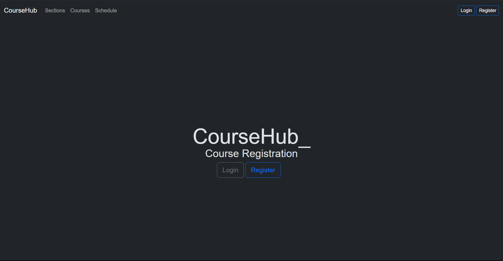
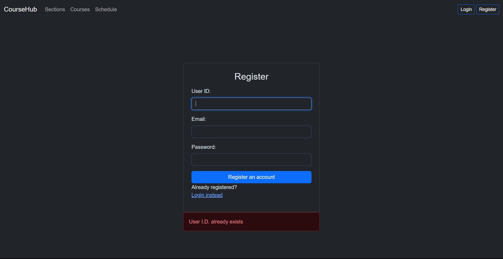
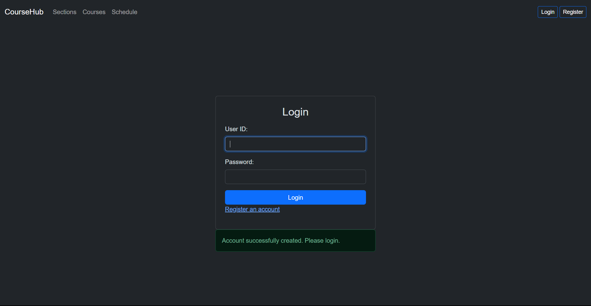
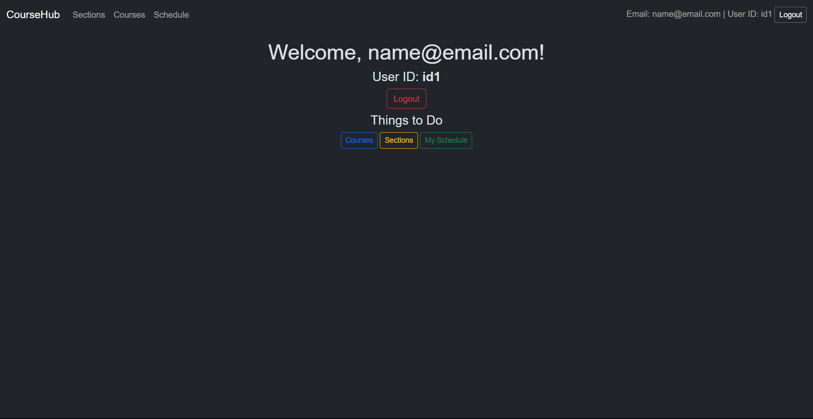
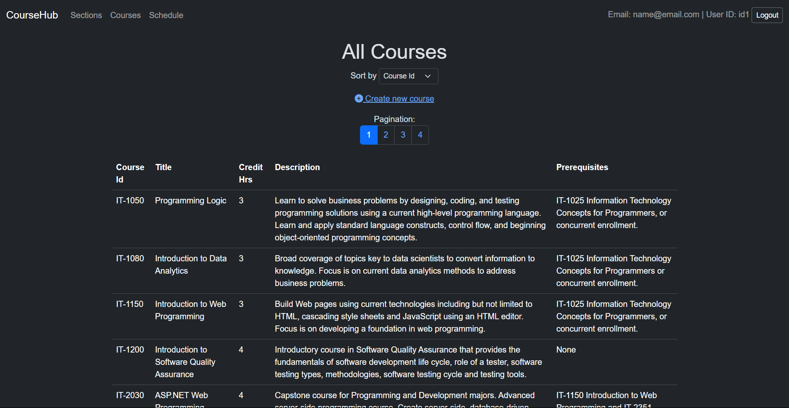
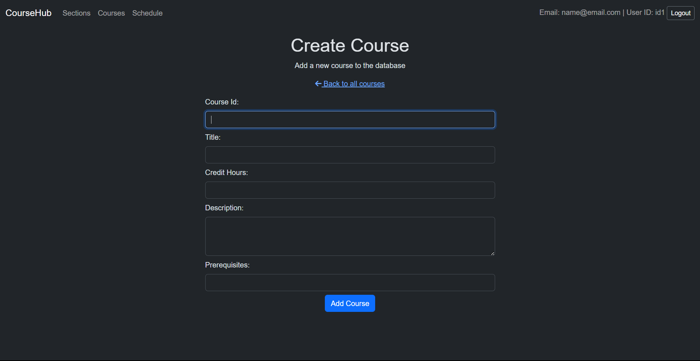
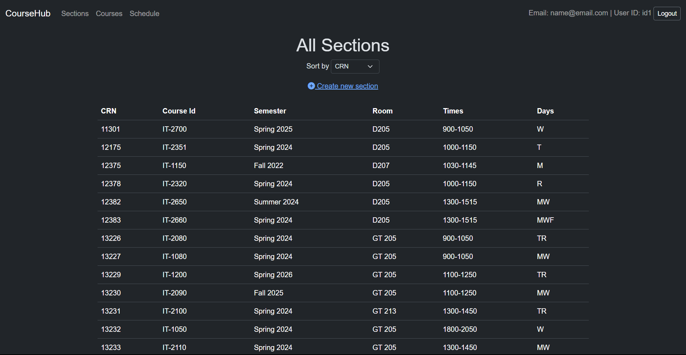
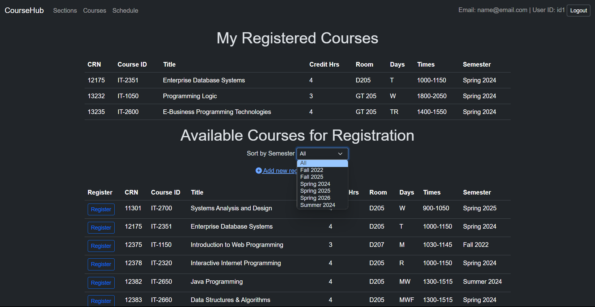

# CourseHub - Course Registration
 

## Setup and Installation
- Open the `connection.php` file and add your username and password to connect to the it1150 database
- Double check included `it1150-2.sql` file for database schema and data verifcation

## Overview
CourseHub is designed for managing educational courses, classes, and sections. It includes features for user authentication, course management, and schedule organization.

## Features
- User Authentication: Sign-up, login, and logout capabilities.
- Course Management: Add and view courses.
- Class and Section Management: Add and manage classes and sections.
- Schedule Display: View schedules related to courses and sections.

## Files Description
- `addclass.php`, `addcourse.php`, `addsection.php`: Scripts for adding classes, courses, and sections.
- `connection.php`: Establishes database connection.
- `courses.php`, `schedule.php`, `sections.php`: Display information about courses, schedules, and sections.
- `login.php`, `logout.php`, `signup.php`: Handle user authentication.
- `navbar.php`: Code for the navigation bar.

### Course Management
- `courses.php`: Displays a list of all courses. It includes features for sorting courses by various attributes like course ID, title, and description. The page also implements pagination, allowing users to view a subset of courses per page, enhancing usability for large datasets. The sorting and pagination functionalities are dynamically managed through GET parameters. Additionally, this page provides a link to `addcourse.php` for creating new courses.
- `addcourse.php` and `addcourse-submit.php`: Interface and backend logic for adding new courses.

### Section Management
- `sections.php`: Lists all available sections in the database.
- `addsection.php` and `addsection-submit.php`: Interface and backend logic for adding new sections, using AJAX for a seamless experience.

### Schedule and Registration
- `schedule.php`: Shows courses registered by the logged-in user. Allows filtering by semester and includes a registration button for each course.
- `addclass.php`: Handles the registration of users for a selected course section, using query string parameters for CRN and semester.

### Supporting Files
- `connection.php`: Establishes a connection to the database.
- `gethint.php`: Used for AJAX-based dynamic data fetching, provides search suggestions or auto-complete functionality.
- `navbar.php`: Provides a common navigation bar for the website.
- `styles.css`: Contains CSS styles for the web application.
- `.htaccess`: Apache server configuration file for URL rewriting and other configurations.
- `it1150-2.sql`: SQL file with the database schema and initial setup.

## Technologies Used
- **Backend**: PHP
- **Frontend**: HTML, CSS, Bootstrap 5, JavaScript (with AJAX)
- **Database**: MySQL

## Usage

### User Sign-Up and Login
- **Sign-Up**: New users should sign up with a user ID, email, and password. 
  - Upon successful sign-up, the user is redirected to the login page with an alert indicating successful user creation.
  - If sign-up fails, an alert is shown on the sign-up page.

  
- **Login**: Users can log in with their credentials.
  - The login is validated against the MySQL database, including a hashed password check.
  - Upon successful login, users are redirected to `index.php`. 

  

### Post-Login Experience

- **Index Page (`index.php`)**: Displays the user's ID and email. Provides links to courses, sections, and schedule. The navbar also shows the user's ID and email. 

- **Courses**:
  - Clicking the 'Courses' button displays all available courses.
  
   
  - Users can create a new course via `addcourse.php`.

  
- **Sections**:
  - The 'Sections' button leads to `addsection.php`, where users can add a section.  
  
   
  - As the user types in the `course_id` input, a hint appears showing matching course IDs from the courses table, implemented via JavaScript and AJAX.  

   
  - Clicking on a hint auto-fills the `course_id`. If no course exists, a link to `addcourse.php` is provided, passing the current input as a convenience.
- **Courses and Sections Management**:
  - Both courses and sections can be sorted by various attributes.

### Schedule and Registration
- **Viewing Schedule (`schedule.php`)**:
  - Users can see their schedule and all available courses for registration.
  - Courses can be sorted by semesters, fetched with the query `SELECT DISTINCT semester FROM sections ORDER BY semester`.
  - A registration button allows users to enroll in courses directly from this page. 

  

### Logout
- A logout button is available for users to securely end their session.

## Additional Notes
- Ensure JavaScript is enabled in the browser for AJAX functionalities to work correctly.
- The system assumes a secure and correctly configured MySQL database for storing and retrieving data.
